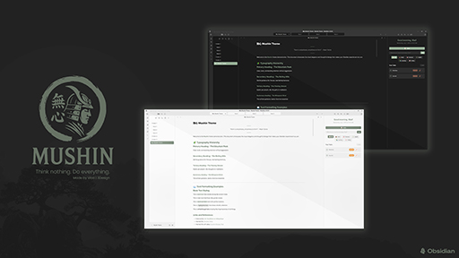

# 無心 Mushin - A Zen-Inspired Obsidian Theme

> *"The mind of no-mind, the flowing state of pure awareness"*

**Mushin** (無心) is an Obsidian theme that embodies the Japanese zen concept of "no-mind" - a state of mental clarity, effortless flow, and pure focus. This theme transforms your note-taking experience into a journey of mental tranquility and enhanced productivity.

## 🔌 Recommended Plugins

This theme works best with the plugins **[MindfulDo](https://github.com/Vlad3Design/MindfulDo)** & **[FadeLine](https://github.com/Vlad3Design/FadeLine)**.

- **[MindfulDo](https://github.com/Vlad3Design/MindfulDo)** - A calm, beautiful and simple todo list for Obsidian that helps you stay organized without stress
- **[FadeLine](https://github.com/Vlad3Design/FadeLine)** - Clarity in the chaos. FadeLine dims the noise so your thoughts can speak

Both plugins are created by the same developer and follow the same zen philosophy as the Mushin theme.

Also, the CSS Styles made by **[efemkay](https://github.com/efemkay): [obsidian-modular-css-layout](https://github.com/efemkay/obsidian-modular-css-layout)** help improve the design, especially enabling in the MCL Wide Views: **Enable Adjustable RLL** and setting the **Max Width for Normal Width page to 1500px**

## 🎋 Philosophy

Inspired by the ancient zen teaching of mushin, this theme eliminates visual distractions and creates a harmonious environment where thoughts can flow like water. Every design decision serves the purpose of achieving mental clarity and deep focus.

### Core Principles
- **Simplicity**: Remove all unnecessary visual elements
- **Clarity**: Enhance readability and comprehension  
- **Flow**: Create smooth, natural transitions and interactions
- **Balance**: Achieve perfect harmony between form and function
- **Mindfulness**: Design that respects and enhances your mental state

## ✨ Features

### 🌸 **Zen Aesthetic**
- Natural color palette inspired by traditional Japanese aesthetics
- Soft shadows and gentle transitions that don't strain the eyes
- Generous whitespace that allows your mind to breathe
- Subtle texture effects that mimic natural paper

### 🎨 **Dual Themes**
- **Light Mode**
- **Dark Mode**
- Seamless transitions between modes
- Both optimized for extended reading and writing sessions

### 📖 **Typography Excellence**
- Carefully selected font stacks for optimal readability
- Harmonious hierarchy that guides the eye naturally
- Generous line spacing for comfortable reading
- Enhanced text rendering with proper font features

### 🧘 **Focus-Oriented Design**
- Distraction-free interface elements
- Centered content with optimal reading width
- Minimal but functional sidebar
- Subtle animations that don't interrupt concentration

### 🎯 **Enhanced Productivity**
- Clear visual hierarchy for better information processing
- Intuitive color coding for different content types
- Smooth hover states and focus indicators
- Accessibility features for inclusive design

## 🛠 Installation

### Method 1: Manual Installation
1. Download the theme files from this repository
2. Copy the entire `Mushin` folder to your Obsidian themes directory:
   - **Windows**: `%APPDATA%\Obsidian\themes\`
   - **macOS**: `~/Library/Application Support/obsidian/themes/`
   - **Linux**: `~/.config/obsidian/themes/`
3. Open Obsidian → Settings → Appearance → Themes
4. Select "Mushin" from the dropdown menu
5. Experience zen ✨

### Method 2: Community Themes (Coming Soon)
The theme will be available through the Obsidian Community Themes browser.

## 🎨 Visual Guide

### Color Palette

#### Light Theme
| Element | Color | Usage |
|---------|-------|-------|
| **Mushin Green** | `#6b7d6b` | Accents, links, active states |
| **Mushin Beige** | `#c9b896` | Tags, subtle highlights |
| **Paper White** | `#fafafa` | Primary background |
| **Ink Black** | `#2c2c2c` | Primary text |
| **Stone Gray** | `#a8a8a8` | Secondary elements |

#### Dark Theme
| Element | Color | Usage |
|---------|-------|-------|
| **Night Green** | `#8fa68f` | Accents, links, active states |
| **Warm Beige** | `#d4c096` | Tags, subtle highlights |
| **Deep Black** | `#1a1a1a` | Primary background |
| **Soft White** | `#e8e8e8` | Primary text |

### Typography
- **Primary Font**: Inter, Noto Sans, Helvetica Neue
- **Monospace**: JetBrains Mono, SF Mono, Monaco
- **Line Height**: 1.6-1.7 for optimal readability
- **Font Features**: Ligatures, kerning, and proper character spacing

## 🧘‍♀️ Best Practices

### For Optimal Experience
1. **Use with distraction-free mode** for pure focus sessions
2. **Adjust your monitor brightness** to match the theme's gentle contrast
3. **Take regular breaks** - the theme is designed for long sessions but your mind needs rest
4. **Combine with mindful note-taking practices** like the Zettelkasten method

### Recommended Settings
```
Settings → Editor → Show line numbers: OFF
Settings → Editor → Fold headings: ON
Settings → Editor → Fold indents: ON
Settings → Appearance → Translucent window: 85%
```

## 🎋 Zen Features

### Hidden Zen Elements
- **Kanji signature**: Look for the subtle 無心 mark in the title bar
- **Breathing space**: Extra padding that allows content to breathe
- **Paper texture**: Subtle background patterns that mimic natural paper
- **Gradient dividers**: Workspace separators that fade naturally
- **Gentle animations**: Elements appear and disappear like thoughts

### Mindful Interactions
- **Soft focus states**: Visual feedback that doesn't jar the mind
- **Natural hover effects**: Interactions that feel organic
- **Smooth scrolling**: Movement that flows like water
- **Calm error states**: Even errors are presented peacefully

## 🌸 Customization

### Custom CSS Variables
You can fine-tune the theme by overriding these CSS variables in your `obsidian.css`:

```css
:root {
  --mushin-accent: #your-color;        /* Change accent color */
  --mushin-background: #your-color;    /* Adjust background */
  --font-text-size: 17px;             /* Increase text size */
  --line-height-normal: 1.8;          /* More line spacing */
}
```

### Advanced Customization
For theme developers and advanced users, the CSS is thoroughly documented with clear sections for easy modification.

## 🤝 Contributing

This theme is a labor of love and meditation. If you'd like to contribute:

1. **Bug Reports**: Open an issue with detailed steps to reproduce
2. **Feature Requests**: Suggest improvements that align with zen principles
3. **Code Contributions**: Submit PRs that maintain the theme's philosophy
4. **Feedback**: Share your mindful note-taking experiences

## 📜 License

This theme is released under the MIT License. Feel free to use, modify, and share in the spirit of open knowledge.

## 🙏 Acknowledgments

- Created by **Vlad 3Design** - [@Vlad3Design](https://github.com/Vlad3Design)
- Inspired by Japanese zen philosophy and aesthetics
- Built with love for the Obsidian community
- Special thanks to the developers of Obsidian for creating such a beautiful platform

## 💭 Final Thought

*"In the beginner's mind there are many possibilities, but in the expert's mind there are few."* - Shunryu Suzuki

May this theme serve as a companion in your journey toward clarity, understanding, and wisdom. Let your thoughts flow like water, and your knowledge grow like bamboo - quietly, persistently, and with grace.

---

**[Download Mushin Theme](https://github.com/Vlad3Design)** | **[Report Issues](https://github.com/Vlad3Design/mushin-obsidian-theme/issues)** 

*Theme Version: 1.0.0 | Compatible with Obsidian 0.16.0+ | Created by Vlad 3Design* 
